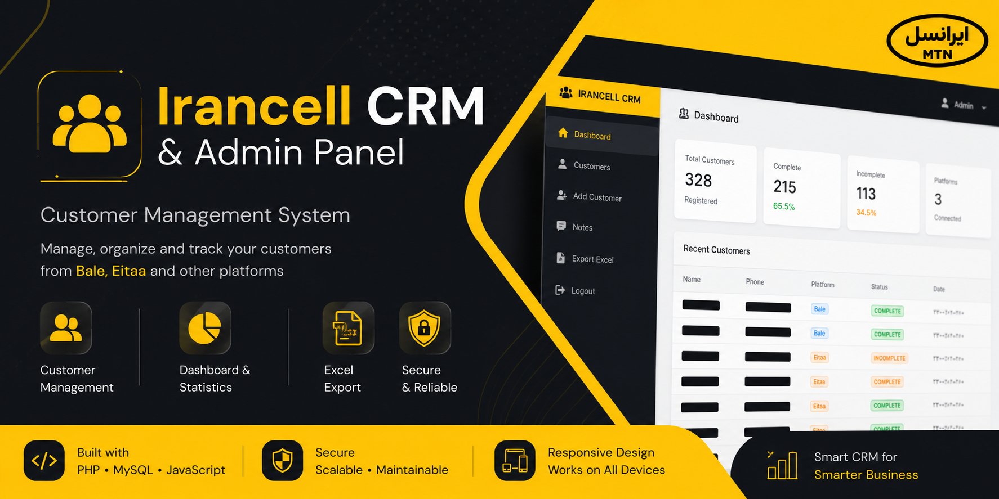
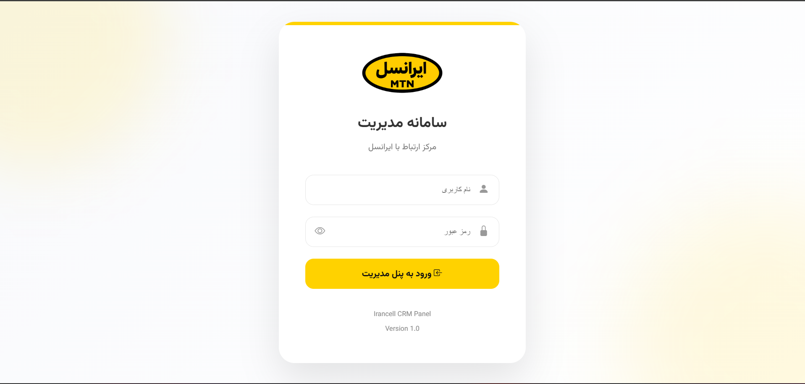
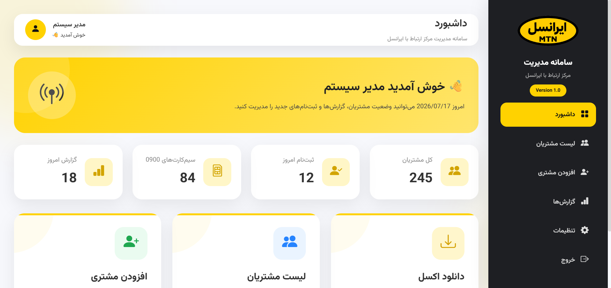
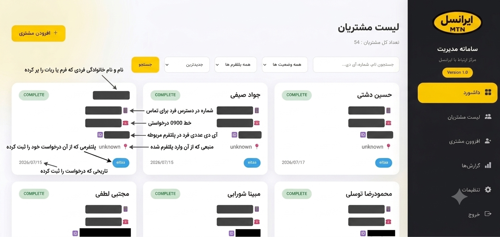
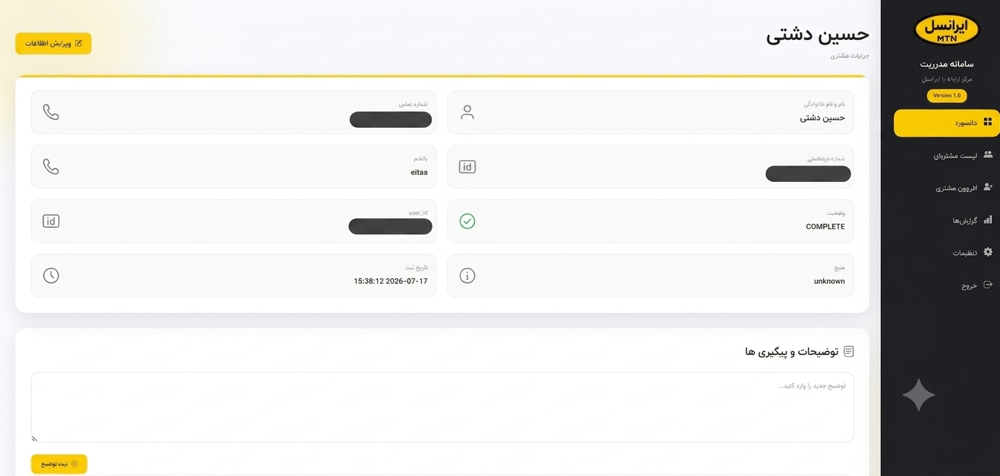
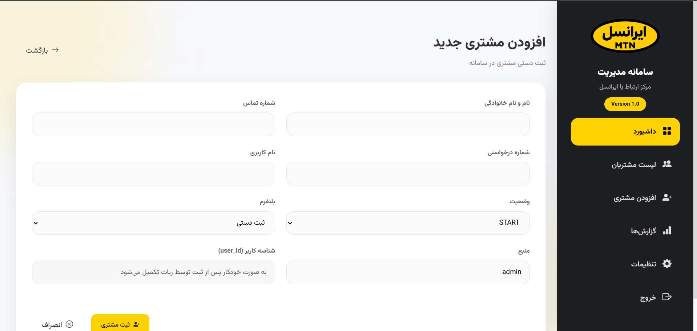
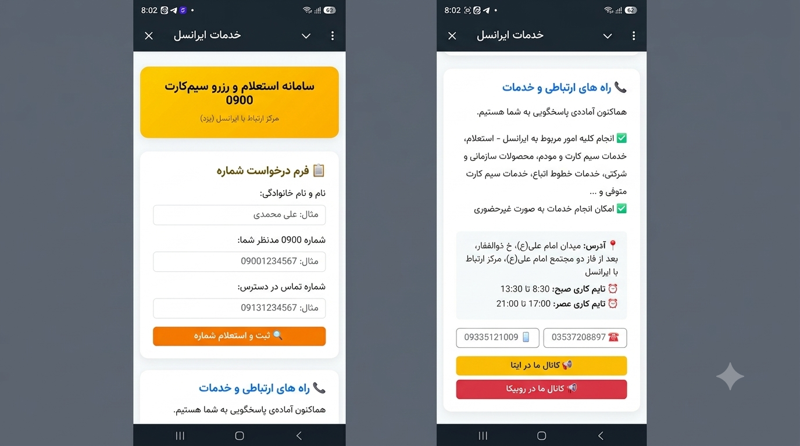

<p align="center">
  
</p>

<h1 align="center">Irancell CRM & Admin Panel</h1>

<p align="center">
Customer Relationship Management System for Bale, Eitaa and Future Messaging Platforms
</p>

<p align="center">


</p>

---

# 📌 Overview

This project is a complete **Customer Relationship Management (CRM)** system developed for an Irancell sales center.

The system collects customer registrations from multiple messaging platforms such as **Bale** and **Eitaa**, stores them in a centralized MySQL database, and allows operators to manage customers through a modern web-based administration panel.

The architecture has been designed so new messaging platforms can easily be integrated in the future.

---

# ✨ Features

### Mini App

- Customer registration
- Mobile number verification
- Desired number registration
- MySQL storage
- Automatic status management

### CRM Dashboard

- Dashboard with statistics
- Customer management
- Customer details
- Customer editing
- Customer search
- Platform filtering
- Status filtering
- Excel export
- Authentication system
- Responsive admin interface

---

# 🛠 Technology Stack

- PHP
- MySQL
- JavaScript
- HTML5
- CSS3

---

# 📂 Project Structure

```
irancellApp/

├── admin/
│   ├── dashboard.php
│   ├── customers.php
│   ├── customer.php
│   ├── customer_add.php
│   ├── customer_edit.php
│   ├── export_excel.php
│   └── includes/
│
├── lib/
│
├── screenshots/
│
├── index.php
├── submit.php
├── config.example.php
├── .gitignore
└── README.md
```

---

# 📸 Screenshots


## login



---

## Dashboard



---

## Customers



---

## Customer Details



---

## Add Customer



---

## Mini App



---


# 🚀 Installation

Clone the repository

```bash
git clone https://github.com/mfazelkh99/irancell-crm.git
```

Open project directory

```bash
cd irancell-crm
```

Create your configuration file

```
config.php
```

Copy values from

```
config.example.php
```

Fill your own

- Database credentials
- Bot Token
- Admin credentials

Import your MySQL database.

Run the project using your preferred PHP server.

---

# 🔒 Security

Sensitive information is intentionally excluded from this repository.

Examples include:

- Database credentials
- Bot Token
- Admin Password
- Admin Username

Use **config.example.php** as a template.

---

# 🚧 Roadmap

- Notes system
- Customer activity history
- Multi-admin support
- Customer tags
- Advanced reports
- Charts & analytics
- Multi-platform integration
- REST API

---

# 💡 Future Platforms

This CRM has been designed to support additional messaging platforms such as:

- Telegram
- WhatsApp
- Rubika
- Gap
- Web Forms
- Future custom integrations

---

# 👨‍💻 Author

**Mohammad Fazel khorrami**

Software Engineer

Building CRM Systems • Python Bots • Full Stack Web Applications

GitHub

https://github.com/mfazelkh99

---

⭐ If you like this project, consider giving it a star.